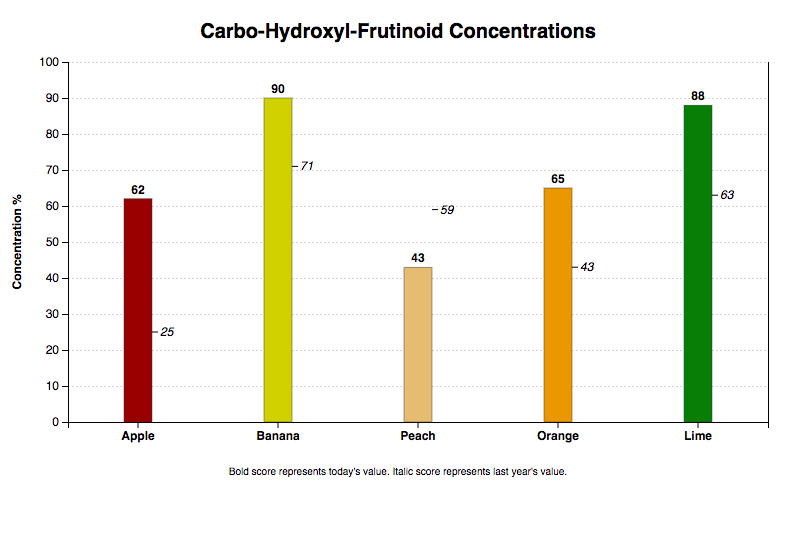
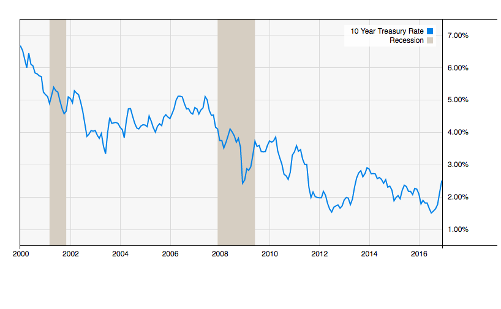
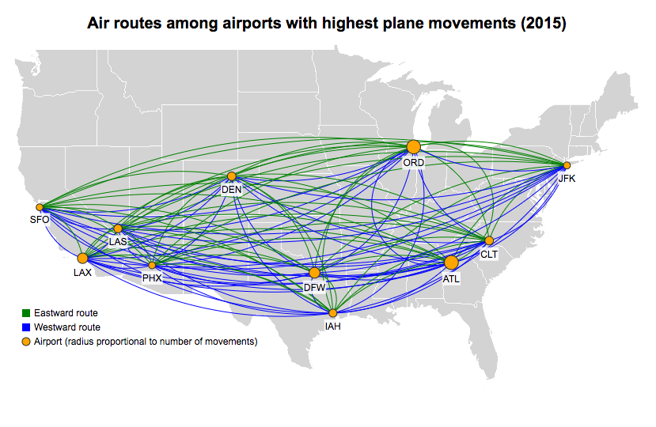

# D3.js static charts demo

[D3.js](https://d3js.org/) is a JavaScript library for generating charts and graphs
in SVG format, which can be displayed in a browser or rendered as an image file.  There
are many JS drawing libraries, but D3.js stands out because it is based on SVG, which is
a W3 standard just like HTML, and SVG is supported by all the major desktop and mobile browsers.

This project contains some D3 examples for the browser.  These particular examples are static,
because all the chart data is available in advance and does not change.

To test it out, simply start up a web server in the src/ dir (e.g. `python3 -m http.server`),
or deploy the contents of the src/ folder to a web server (e.g. Apache), and then view
http://localhost/index.html in your browser.  Be advised, you can't view it as file://
because the D3 code makes http requests to obtain the example data.

...And in fact you don't even need to use your web server, because we've got screenshots of
the results right here:

* Bar Chart

* Rate Chart

* US Map Overlay

### Attributions

Airport movement statistics are from [wikipedia](https://en.wikipedia.org/wiki/List_of_busiest_airports_by_aircraft_movements).

The United States map is taken from a world map, also on [wikipedia](https://commons.wikimedia.org/wiki/File:Blank_Map_Equirectangular_states.svg),
which was originally made available into the public domain.  I edited that version.
